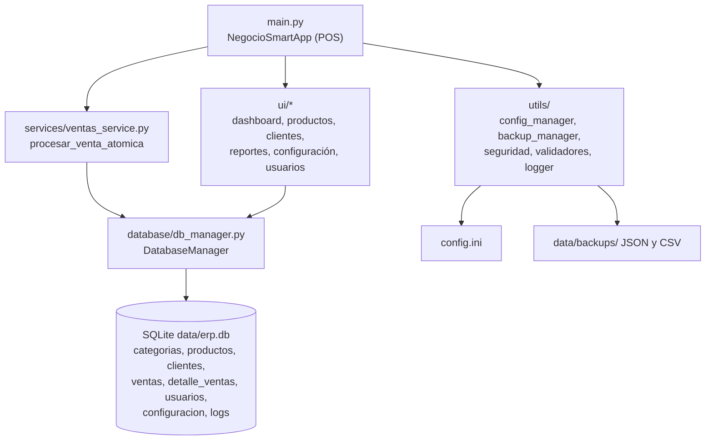

<div align="center">
  
  <h1>NegocioSmart</h1>
  <p><b>Punto de venta e inventario de escritorio, offline y sin suscripción, para pequeños negocios.</b></p>
  
  
  
  
  
  
  
  <p>
    <a href="#-inicio-rápido">Inicio rápido</a> ·
    <a href="#-características">Características</a> ·
    <a href="#-arquitectura">Arquitectura</a> ·
    <a href="#-pruebas">Pruebas</a> ·
    <a href="#-lo-que-todavía-no-existe">Limitaciones</a>
  </p>
</div>

NegocioSmart es una aplicación de escritorio (Python + CustomTkinter + SQLite) para cobrar, controlar
stock y ver reportes básicos en una sola computadora, sin internet. Es un **MVP de un solo usuario**:
la venta atómica y la matemática de dinero están cubiertas por tests, pero no hay login activo,
facturación real ni exportación a PDF/Excel.

## 🎬 Vista rápida

No hay capturas: la interfaz es de escritorio (CustomTkinter) y no se pudo renderizar sin una sesión
gráfica interactiva. Flujo principal, tal como lo implementa `main.py`:

```text
python main.py
 |
 |- 1ª vez: crea data/erp.db, siembra un catálogo de ejemplo
 |- Menú lateral: Dashboard | Productos | Punto de Venta | Clientes | Reportes | Configuración | Usuarios | Salir
 `- Punto de Venta: buscar producto -> carrito -> "Procesar Venta"
      -> una transacción SQLite descuenta stock y registra ventas + detalle_ventas
         (si una línea no tiene stock, no se aplica nada)
```

## ✨ Características

| Característica | Detalle |
|---|---|
| Punto de venta | Carrito con búsqueda de productos y totales. `services/ventas_service.py::procesar_venta_atomica` descuenta stock y registra venta y detalle en **una sola transacción**; el `UPDATE ... WHERE stock_actual >= cantidad` impide sobreventa. |
| Dinero exacto | Totales, descuentos e impuestos con `decimal.Decimal`, redondeo a centavos; los descuentos nunca superan el importe descontado. |
| Inventario | Alta/edición de productos y categorías, ajuste de stock (entrada, salida, cantidad exacta), validación de cantidades y precios, alertas de stock bajo. |
| Clientes y proveedores | Alta de clientes con historial de compras; módulo de proveedores en `modules/proveedores.py`. |
| Reportes | Resumen del día, historial y estadísticas; respaldo JSON/CSV en `data/backups/` (`utils/backup_manager.py`). |
| Configuración | Negocio, moneda, impuesto, umbral de stock bajo, etc. en `config.ini`. |
| Contraseñas | `usuarios.password_hash` con PBKDF2-HMAC-SHA256 y sal aleatoria (`utils/seguridad.py`). |
| Consultas SQL | `database/consultas.py` usa parámetros ligados (`?`). |

## 🏗️ Arquitectura



## 🚀 Inicio rápido

| Requisito | Detalle |
|---|---|
| Python | 3.8 o superior (CI: 3.8 a 3.12 en Linux, Windows y macOS) |
| Base de datos | SQLite, incluida en la librería estándar |
| Dependencias | `requirements.txt` (customtkinter, matplotlib, pandas, Pillow, etc.) |

```bash
git clone https://github.com/Luiss2080/NegocioSmart.git
cd NegocioSmart
python -m venv .venv
source .venv/bin/activate      # Windows: .venv\Scripts\activate
pip install -r requirements.txt
python verificar_entorno.py    # opcional: comprueba que el entorno esté completo
python main.py
```

> La aplicación gráfica no se ejecutó al preparar este README (CustomTkinter no estaba instalado);
> los tests sí se ejecutaron.

<details>
<summary>Estructura de carpetas</summary>

```text
main.py                 Aplicación principal (POS y ventanas)
ui/                     dashboard, productos, ventas, clientes, reportes, configuración, usuarios
modules/                inventario, proveedores, reportes (avanzado, con datos demo)
services/               ventas_service (venta atómica)
database/               db_manager, consultas, migraciones, modelos, seeders
utils/                  config_manager, backup_manager, seguridad, validadores, logger, constantes
tests/                  test_money_math, test_ventas_service, test_consultas_sql, test_seguridad, test_validadores
config.ini              Configuración del negocio (moneda MXN, impuesto 0.16 por defecto)
docs/, INSTALACION.md, CONTRIBUTING.md, SECURITY.md, CHANGELOG.md
```

</details>

<details>
<summary>Configuración (config.ini)</summary>

Secciones presentes: `DATABASE`, `APPLICATION`, `BUSINESS`, `INVOICE`, `REPORTS`, `SECURITY`,
`INVENTORY`, `POS`, `LOGGING`, `UI`, `NOTIFICATIONS`, `BACKUP`, `DEVELOPMENT`. Los valores por
defecto son de ejemplo (`Mi Negocio`, `MXN`, `tax_rate = 0.16`); no todas las claves tienen efecto
en el código. No pongas credenciales reales en `config.ini` (la sección `NOTIFICATIONS` trae campos
de correo vacíos).

</details>

## 🧪 Pruebas

```bash
pip install -r requirements.txt -r requirements-dev.txt
pytest -v
```

**37 tests** (verificado: 37 passed) sobre las zonas de mayor riesgo: matemática de dinero
(descuentos del 100 %, mayores al importe, cantidades negativas o cero), venta atómica (sobreventa,
carritos mixtos con una línea sin stock, ventas seguidas), consultas SQL parametrizadas, hashing de
contraseñas y validadores. Los tests de base de datos usan un SQLite real temporal. La CI
(`.github/workflows/test.yml`) corre la suite en Linux, Windows y macOS con Python 3.8 a 3.12, más
flake8 y comprobaciones de seguridad (bandit, safety y pip-audit; bandit y pip-audit no
bloquean el resultado).

## 🔒 Seguridad

- Consultas parametrizadas y contraseñas con PBKDF2-HMAC-SHA256 y sal.
- `enable_login = false` por defecto: **la interfaz no pide credenciales** aunque exista la tabla
  `usuarios`.
- `data/erp.db` no está cifrada; en un equipo compartido protégela a nivel de sistema operativo.
- Política de reporte de vulnerabilidades en [`SECURITY.md`](SECURITY.md).

## 🚧 Lo que todavía no existe

- Pantalla de login y control de acceso por rol en la interfaz.
- Exportación real a PDF y Excel: `reportlab` y `openpyxl` están declaradas, pero sin uso. El módulo
  `modules/reportes.py` trabaja con datos de demostración y su PDF está simulado; sí funciona el
  respaldo JSON/CSV.
- Gráficos activos: `matplotlib` se importa en el módulo de reportes avanzado, pero no dibuja
  gráficos reales.
- Multiusuario o multi-equipo: es una sola app sobre un archivo SQLite local.
- Facturación fiscal, impresión de tickets y lector de códigos de barras: hay claves en
  `config.ini` (`INVOICE`, `POS`), sin funcionalidad completa que las respalde.
- `main.py` es un archivo monolítico de casi 4000 líneas; la lógica separada en `services/`,
  `database/` y `utils/` es la parte con tests.

## 📄 Licencia

MIT con términos adicionales para uso comercial (atribución sugerida, sin garantía sobre cálculos,
redistribución con la licencia). Por eso GitHub puede mostrarla como "Other". Texto completo en
[`LICENSE`](LICENSE).

<div align="center"><sub>Hecho por Luiss2080 · Python + CustomTkinter + SQLite</sub></div>
